# 📋 Experiment 6.1 — Handling Forms Using Controlled Components in React

> **Full Stack Lab | React.js | Vite**

---

## 📌 Table of Contents

- [Aim](#-aim)
- [Software Requirements](#-software-requirements)
- [Theory](#-theory)
- [Project Structure](#-project-structure)
- [Form Fields Overview](#-form-fields-overview)
- [File-wise Code Description](#-file-wise-code-description)
- [How to Run](#-how-to-run)
- [Screenshots](#-screenshots)
- [Key Concepts Used](#-key-concepts-used)
- [Output / Result](#-output--result)

---

## 🎯 Aim

To create and handle forms in a frontend application using **Controlled Components** in React. The form captures student registration details and displays all submitted data in a browser alert as well as in a structured summary card below the form.

---

## 🛠️ Software Requirements

| Tool         | Description                              |
|--------------|------------------------------------------|
| **Node.js**  | JavaScript runtime (v16+ recommended)   |
| **React**    | Frontend UI library (v18+)              |
| **Vite**     | Fast build tool & dev server            |
| **VS Code**  | Recommended code editor                 |
| **Web Browser** | Chrome / Firefox / Edge              |

---

## 📚 Theory

### What are Controlled Components?

In React, **Controlled Components** are form elements whose values are controlled by the component's **state** rather than the DOM itself.

- Every input field has its value linked to a `useState` variable.
- On every keystroke or selection change, `setState` is called via `onChange` handler.
- This gives React **full control** over the form data at every point in time.

### Why Use Controlled Components?

| Feature | Controlled | Uncontrolled |
|--------|-----------|--------------|
| State Management | React state (useState) | DOM ref (useRef) |
| Real-time Validation | Yes - Easy | No - Complex |
| Programmatic Reset | Yes - Simple | No - Manual DOM reset |
| Value Access on Submit | Yes - From state | No - From ref |

### Input Types Used in This Experiment

| Input Type | HTML Element | Purpose |
|-----------|-------------|---------|
| Text Input | input type text | First Name, Last Name |
| Date Picker | input type date | Date of Birth |
| Radio Button | input type radio | Gender Selection |
| Checkbox | input type checkbox | Skills (multi-select) |
| Textarea | textarea | Address |
| Dropdown | select | State & Country |

---

## 📁 Project Structure

```
exp6-react-form/
│
├── public/
│   └── vite.svg
│
├── src/
│   ├── main.jsx                  # React DOM entry point
│   ├── App.jsx                   # Root component with header
│   ├── App.css                   # App-level styling & animations
│   ├── index.css                 # Global CSS variables & reset
│   │
│   ├── components/
│   │   └── FormComponent.jsx     # Main form with all 8 input fields
│   │
│   └── styles/
│       └── FormComponent.css     # Complete form styling
│
├── index.html                    # Vite HTML entry
├── vite.config.js                # Vite configuration
├── package.json
└── README.md
```

---

## 📝 Form Fields Overview

The Student Registration Form contains **8 input fields** covering all major HTML input types:

| # | Field Name    | Input Type          | React Handling                             |
|---|--------------|--------------------|--------------------------------------------|
| 1 | First Name   | text               | handleInputChange → formData.firstName     |
| 2 | Last Name    | text               | handleInputChange → formData.lastName      |
| 3 | Date of Birth | date (Calendar)   | handleInputChange → formData.dob           |
| 4 | Gender       | radio              | handleInputChange → formData.gender        |
| 5 | Skills       | checkbox (multi)   | handleSkillChange → formData.skills[]      |
| 6 | Address      | textarea           | handleInputChange → formData.address       |
| 7 | State        | select dropdown    | handleInputChange → formData.state         |
| 8 | Country      | select dropdown    | handleInputChange → formData.country       |

---

## 📄 File-wise Description

### main.jsx
- Entry point of the React application.
- Mounts the App component into root using ReactDOM.createRoot().
- Wraps the app in React.StrictMode.

### App.jsx
- Root layout component.
- Renders a styled header with the title **"STUDENT REGISTRATION FORM"**.
- Renders FormComponent inside main.

### App.css
- Styles the outer app-container with a flex column layout.
- Adds slideDown animation to the header and slideUp animation to the main content.
- Responsive adjustments for screens 768px and below.

### index.css
- Global CSS reset (margin 0, padding 0, box-sizing border-box).
- Defines **CSS custom properties** (variables) such as primary-color, secondary-color, danger-color, etc.
- Sets a **gradient background**: linear-gradient from #667eea to #764ba2.
- Custom scrollbar styles.

### FormComponent.jsx
- Core component containing the entire form logic.
- Uses useState for formData (all input values) and submittedData (result state).
- **handleInputChange** — generic handler for text, date, radio, textarea, and select inputs.
- **handleSkillChange** — dedicated handler for checkbox array (Skills), adds or removes skills from the array.
- **handleSubmit** — prevents default page reload, shows browser alert() with all form data, sets submittedData.
- **handleCancel** — resets all fields back to empty state and clears submitted data.
- Renders all 8 fields as controlled components.
- Shows submitted data in both an **alert dialog** and a **summary card** below the form.

### FormComponent.css
- **form-wrapper** — white card with box-shadow and border-radius.
- **form-row** — CSS Grid (2 columns, responsive to 1 column on mobile).
- **radio-group / checkbox-group** — styled input groups.
- **btn-submit** — gradient blue button with hover lift effect.
- **btn-cancel** — gray button with hover color effect.
- **submission-details** — green-bordered success card with animated slideDown.
- **details-grid** — responsive grid displaying submitted data fields.

---

## 🚀 How to Run

**Step 1 — Create a new Vite + React project** (if starting fresh)

Run `npm create vite@latest exp6-react-form -- --template react`, then navigate into the folder with `cd exp6-react-form`.

**Step 2 — Install dependencies**

Run `npm install` inside the project folder.

**Step 3 — Replace source files**

Copy the provided files into the src/ directory:
- src/main.jsx — Replace existing
- src/App.jsx — Replace existing
- src/App.css — Replace existing
- src/index.css — Replace existing
- src/components/FormComponent.jsx — Create new
- src/styles/FormComponent.css — Create new

**Step 4 — Start the development server**

Run `npm run dev`.

**Step 5 — Open in browser**

Navigate to `http://localhost:5173` in your browser.

---

## 📸 Screenshots
---
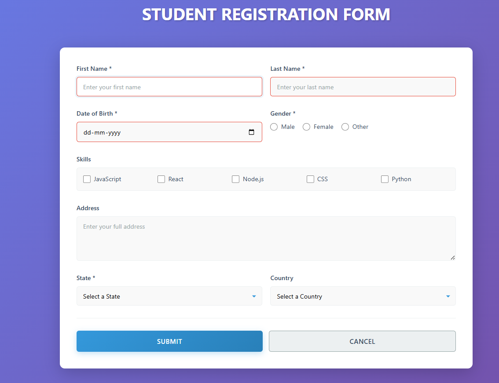

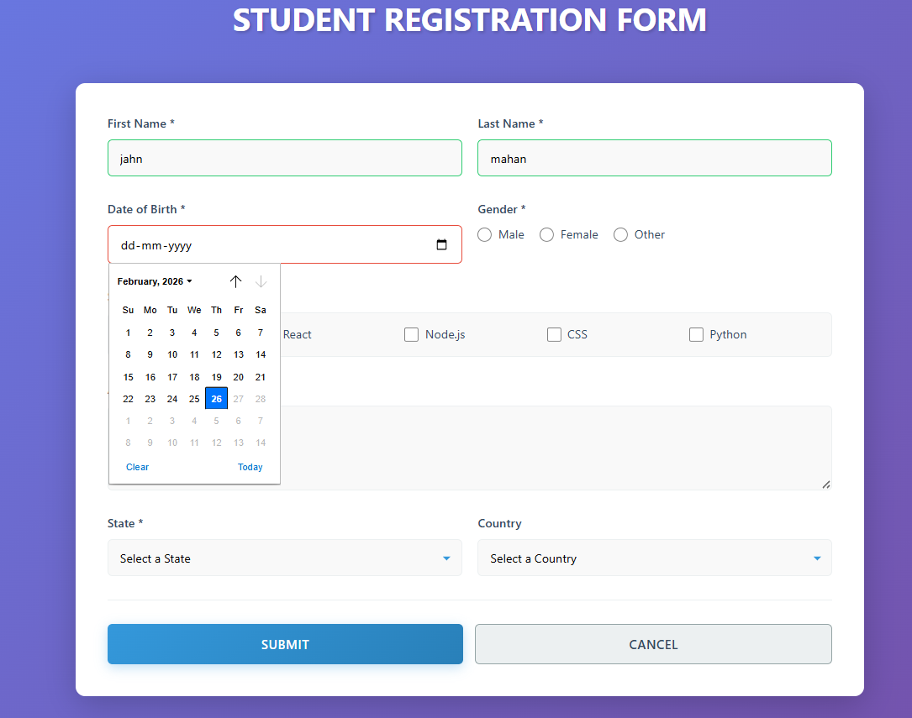

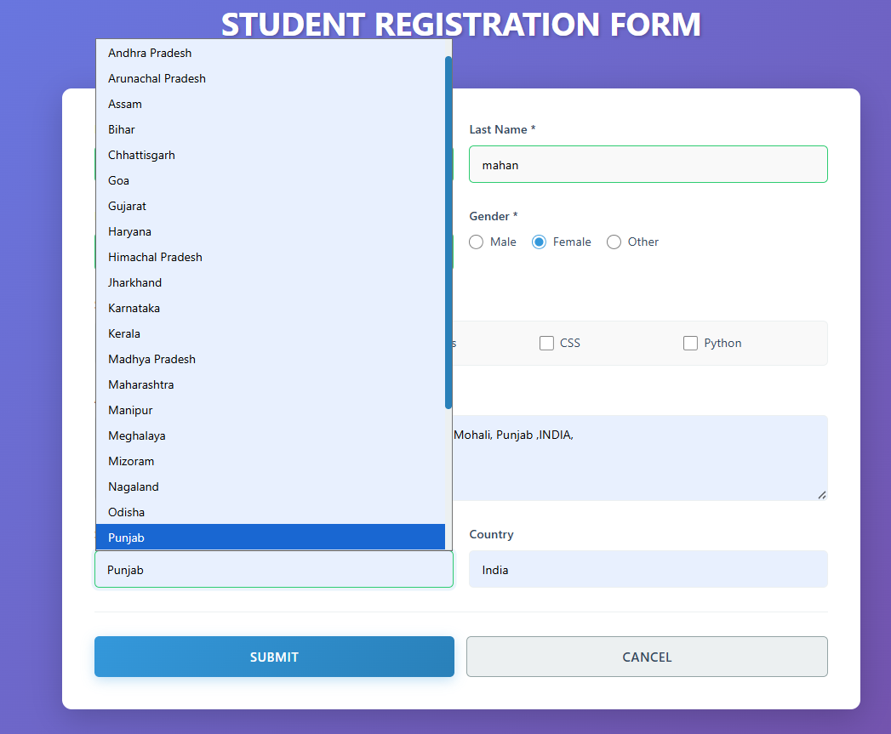

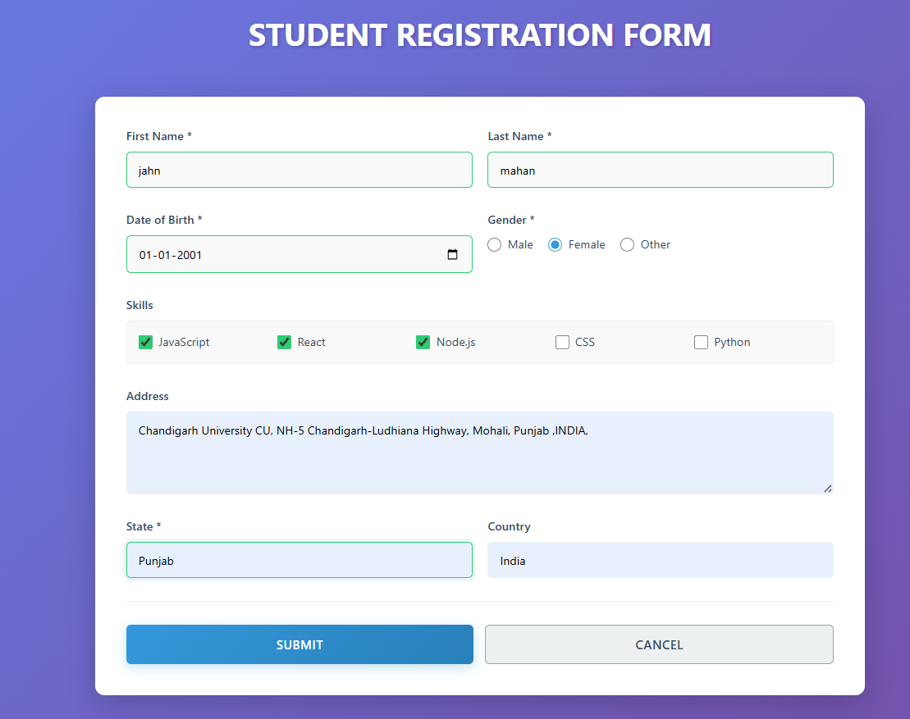

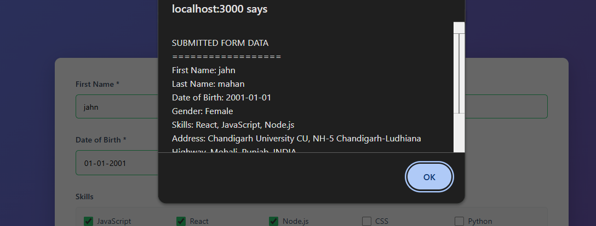
---

## 💡 Key Concepts Used

| Concept | Description |
|--------|-------------|
| **Controlled Components** | All inputs bound to useState via value and onChange |
| **useState Hook** | Manages formData object and submittedData |
| **Spread Operator** | Used for immutable state updates across all handlers |
| **Computed Property Names** | Dynamically updates the correct field using [name]: value |
| **Array State (Skills)** | Skills array updated immutably with spread and filter |
| **e.preventDefault()** | Stops default browser form submission and page reload |
| **Conditional Rendering** | Submission card is shown only after successful form submit |
| **CSS Custom Properties** | CSS variables for consistent theming across components |
| **CSS Grid** | Responsive 2-column form layout with media query fallback |
| **CSS Animations** | slideDown, slideUp, fadeIn keyframe animations |

---

## ✅ Output / Result

Upon clicking **Submit**:

1. A **browser alert box** pops up with all form data displayed in a readable format.
2. After dismissing the alert, a **"Form Submitted Successfully!"** card appears below the form with all submitted values displayed in individual labeled cards.

Upon clicking **Cancel**:
- All form fields are instantly reset to their empty/default values.
- The submission summary card (if visible) disappears.

---

## 📝 Procedure (Summary)

1. **Created** a new React application using Vite.
2. **Designed** a FormComponent with 8 different input types.
3. **Used useState** to store all input values in a single formData object.
4. **Handled input changes** using handleInputChange (generic) and handleSkillChange (checkbox array).
5. **Submitted the form** using handleSubmit which calls alert() to display all details and stores data in state.
6. **Implemented Cancel** functionality using handleCancel to reset form state.
7. **Styled** the application with a gradient background, animated card layout, and responsive CSS Grid.

---

# # 📋 Experiment 6.2-Candidate Login Form (Email & Password Validation) 
> **Full Stack Lab | React.js | Vite | Controlled Components**

---

## 📌 Table of Contents
- [🎯 Aim](#-aim)
- [🛠️ Software Requirements](#️-software-requirements)
- [📚 Theory / Concept](#-theory--concept)
- [✅ Validation Rules](#-validation-rules)
- [📁 Project Structure](#-project-structure)
- [📄 File-wise Description (No Code)](#-file-wise-description-no-code)
- [🚀 How to Run](#-how-to-run)
- [📸 Screenshots](#-screenshots)
- [✅ Output / Result](#-output--result)
- [📝 Notes](#-notes)

---

## 🎯 Aim
To build a **Candidate Login Form** in React using **Controlled Components**, containing only:
1) **Email ID**  
2) **Password**  

The form performs **client-side validation**, shows field-wise error messages, and enables **Submit** only when inputs are valid. [Source](https://www.genspark.ai/api/files/s/D8SSLzpu)

---

## 🛠️ Software Requirements

| Tool | Purpose |
|------|---------|
| **Node.js** | JavaScript runtime (v16+ recommended) |
| **React (v18+)** | UI library for building components |
| **Vite** | Development server + bundler |
| **VS Code** | Code editor (recommended) |
| **Browser** | Chrome / Edge / Firefox |

---

## 📚 Theory / Concept

### What are Controlled Components?
In React, a **controlled component** means:
- Each input’s value is stored in React **state** (`useState`)
- Every change updates state via `onChange`
- Validation and UI feedback become easy and consistent

This experiment uses state to manage:
- Email value
- Password value
- Error messages for each field
- “Touched” state (to show errors after the user interacts) [Source](https://www.genspark.ai/api/files/s/D8SSLzpu)

---

## ✅ Validation Rules

### 1) Email Validation
Email must:
- Contain `@`
- End with a valid domain such as **.com**, **.in**, or any **country code / TLD** (2+ letters)

Examples:
- Valid: `user@gmail.com`, `student@college.in`, `name@domain.uk`
- Invalid: `usergmail.com`, `user@domain`, `user@domain.c` [Source](https://www.genspark.ai/api/files/s/D8SSLzpu)

---

### 2) Password Validation
Password must satisfy **all** conditions:
1. Starts with a **Capital Letter**
2. Contains **at least one number**
3. Contains **at least one special character**
4. Has **minimum 5 characters** total [Source](https://www.genspark.ai/api/files/s/D8SSLzpu)

Examples:
- Valid: `A1@bc`, `P9#xy`
- Invalid: `a1@bc` (doesn’t start with capital), `Abcde` (no number/special char)

---

## 📁 Project Structure
```
your-project/
│
├── src/
│   ├── main.jsx        # React entry point
│   ├── App.jsx         # Login form + validation logic
│   ├── App.css         # Form UI styling (card, inputs, error styles)
│   └── index.css       # Global styles / default Vite styles
│
├── index.html
├── package.json
└── README.md
```

---

## 📄 File-wise Description (No Code)

### `main.jsx`
- Mounts the React app into the DOM using the root element.
- Loads the `App` component as the main UI entry. [Source](https://www.genspark.ai/api/files/s/zSqYhFdf)

### `App.jsx`
Implements the complete form behavior:
- Two controlled inputs: **Email ID** and **Password**
- Validation functions for email and password rules
- Shows error messages below each field after the field is interacted with (“touched”)
- Disables **Submit** until both fields are valid
- On successful validation, shows an alert: **“Form submitted successfully”** [Source](https://www.genspark.ai/api/files/s/D8SSLzpu)

### `App.css`
Handles UI/UX styling:
- Centered layout with a **gradient background**
- White form card with shadow and rounded corners
- Error state styling for invalid inputs (`input-error`)
- Styled submit button + disabled state styling [Source](https://www.genspark.ai/api/files/s/0s7DFBnc)

### `index.css`
Provides global/default styling (Vite baseline styles such as root font settings, link styles, etc.). [Source](https://www.genspark.ai/api/files/s/tynTVmcU)

---

## 🚀 How to Run

1. **Install dependencies**
   ```bash
   npm install
   ```

2. **Start development server**
   ```bash
   npm run dev
   ```

3. **Open in browser**
   - Vite will show a local URL (typically `http://localhost:5173`)

---

## 📸 Screenshots

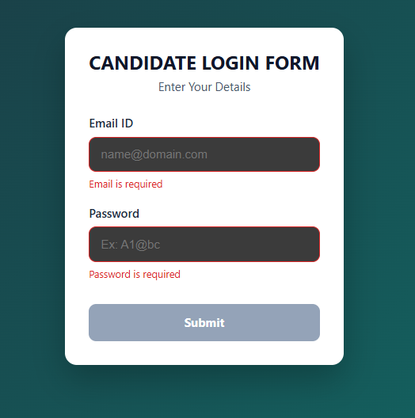

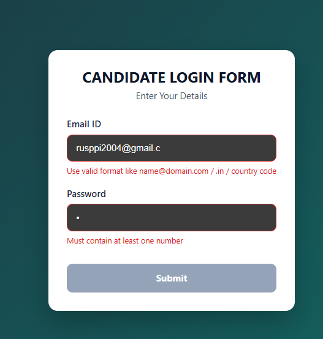

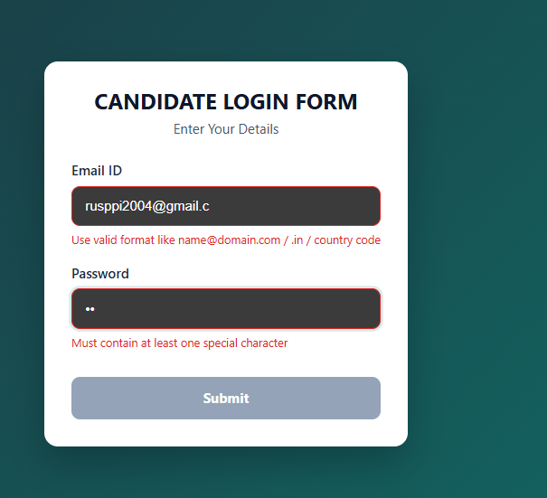

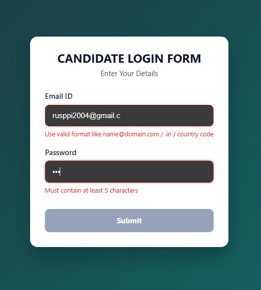

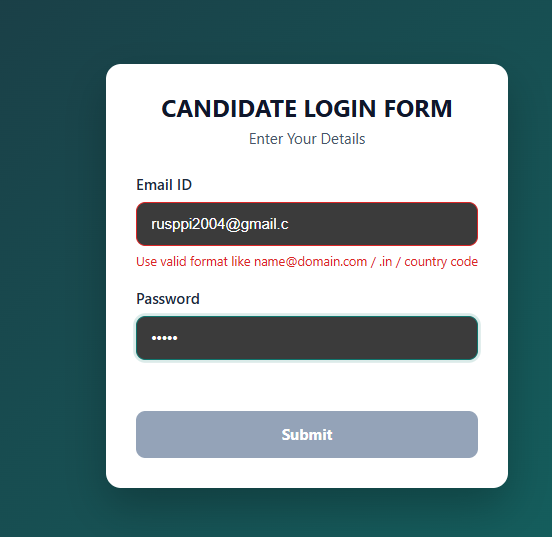

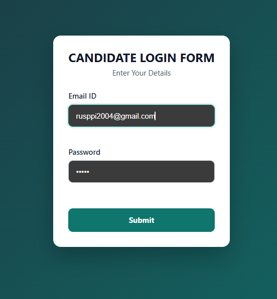

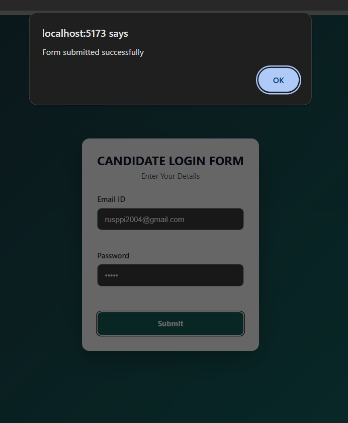
---

## ✅ Output / Result
- The form initially displays two fields: **Email ID** and **Password**
- If the user enters invalid data, the corresponding error message is displayed below the field
- **Submit** remains disabled until:
  - Email matches the required format
  - Password satisfies all specified constraints
- On valid submit: an alert message confirms success [Source](https://www.genspark.ai/api/files/s/D8SSLzpu)

---

## 📝 Notes
- This experiment demonstrates **real-time validation UX** using:
  - `useState` for field values + errors
  - “touched” logic to avoid showing errors before interaction
  - Conditional styling for invalid inputs [Source](https://www.genspark.ai/api/files/s/D8SSLzpu)
